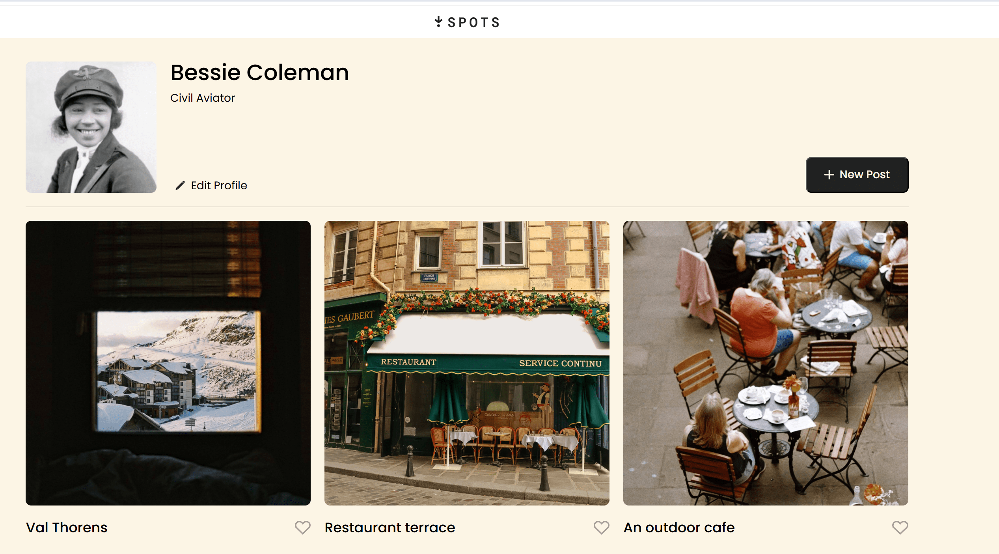
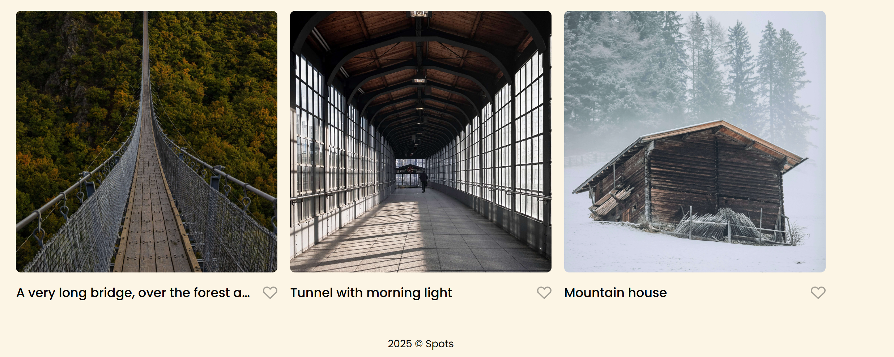

# Project 3: Spots

## Overview

This project is a responsive image gallery website that showcases a collection of images. Built with HTML and CSS, the website demonstrates advanced responsive web design techniques, ensuring a seamless viewing experience across all device sizes from mobile phones to desktop computers.

Key features include:

- Responsive grid layout that adapts to different screen sizes
- Custom font implementation using Google's Poppins font family
- Consistent image sizing and formatting
- BEM methodology for organized and maintainable code structure

The project was designed in Figma and implemented using modern CSS techniques including Flexbox and Grid layouts, demonstrating the journey from design to deployment.

## Features

Development Tools & Technologies:

- HTML
- CSS
- BEM methodology
- Git Hub page deployment

Design Elements:

- Responsive Design
- Dynamic Grid layout
- Custom Google Fonts integration
- Media queries
- Images Optimization - use of correct size, format, and high-quality image display

Design Tools:

- Figma

## Figma

- [Spots Project Design](https://www.figma.com/file/BBNm2bC3lj8QQMHlnqRsga/Sprint-3-Project-%E2%80%94-Spots?type=design&node-id=2%3A60&mode=design&t=afgNFybdorZO6cQo-1)

## Images

[Video demo](https://drive.google.com/file/d/1e4zA6gwvSPwyeXrLVj9JsUcHMNOgWuih/view?usp=sharing)

## Deployment Link

[Live demo](https://saulgood04.github.io/se_project_spots/)
