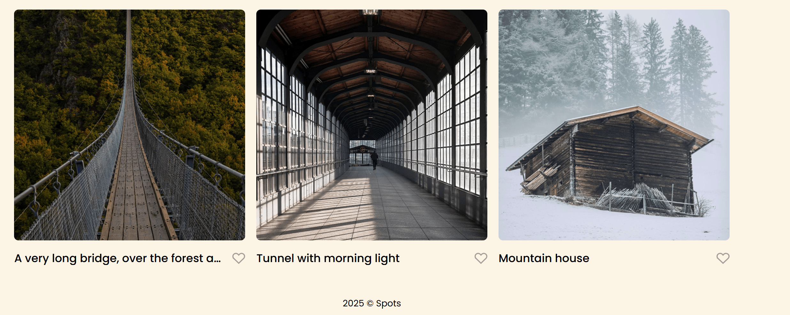

# Project 3: Spots

An image viewing site

### Overview

- Intro
- Figma
- Images
- HTML
- Css
- Responsive design

**Intro**

This project is made so all the elements are displayed correctly on popular screen sizes. We recommend investing more time in completing this project, since it's more difficult than previous ones.

**Figma**

- [Spots Project Design](https://www.figma.com/file/BBNm2bC3lj8QQMHlnqRsga/Sprint-3-Project-%E2%80%94-Spots?type=design&node-id=2%3A60&mode=design&t=afgNFybdorZO6cQo-1)

**Images**

Video link- https://drive.google.com/file/d/1x6Zye5cIoQeY0cDzvrRyxuOh1xtIWE4a/view?usp=sharing

## Deployment Link

https://saulgood04.github.io/se_project_spots/
